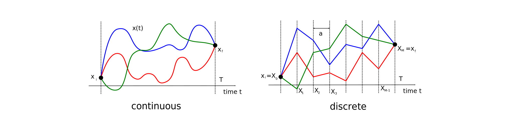
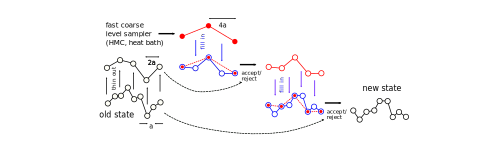
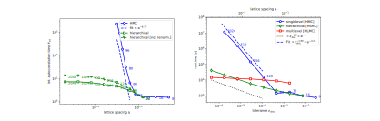

# Overview 

Repository for the implementation of **Multilevel MCMC path integral methods in quantum physics**. The code was used to produce the results in [Jansen, Mueller and Scheichl (2020)](https://arxiv.org/abs/2008.03090). The central idea is to apply the Multilevel Markov Chain Monte Carlo algorithm described in [Dodwell et al. (2015)](https://arxiv.org/abs/1303.7343) to path integrals that arise in the statistcal formulation of quantum mechanics. An accessible introduction to the latter can be found in [Creutz and Freedman (1981)](https://www.sciencedirect.com/science/article/pii/0003491681900749).


*Fig. 1: Path integral formulation of quantum mechanics in the continuum (left) and on a lattice (right).*

While Multilevel MCMC is a variance reduction technique that can further accelerate existing sampling algorithms, one of the key findings of [Jansen, Mueller and Scheichl (2020)](https://arxiv.org/abs/2008.03090) is that hierarchical sampling substantially reduces autocorrelations in the Markov chain. The central idea is to use a two-level Metropolis Hastings step to screen samples from the coarser levels. This can be viewed as an extension of the delayed acceptance method in [Christen and Fox (2005)](https://www.tandfonline.com/doi/pdf/10.1198/106186005X76983).


*Fig 2.: Hierarchical sampling*

For further details on the methods see [Jansen, Mueller and Scheichl (2020)](https://arxiv.org/abs/2008.03090).

### Results
The following plot shows the reduction in integrated autocorrelations for the topological oscillator (left) and the improvement in runtime for a double well potential (right). Results are shown in blue for a single-level Hybrid Monte Carlo method (HMC), in green for the hierarchical sampler and in red for the multilevel Monte Carlo method.


*Fig 3: integrated autocorrelation time (left) and runtime (right) as a function of the lattice spacing.*

### Supported systems
The code currently supports the following quantum mechanical systems.

 * Harmonic oscillator
 * Quartic potential 
 * Quantum mechanical rotor or topological oscillator. A more detailed description of the system can be found in [Ammon at al. (2016)]((https://arxiv.org/abs/1503.05088)).

 It has also been extended to two-dimensional problems in quantum field theory. So far, only the Gaussian Free Field (GFF) and the quenched Schwinger model have been implemented.

## Compilation

### Prerequisites
The code requires the following two packages:

* The [Eigen library](http://eigen.tuxfamily.org/index.php?title=Main_Page) for dense linear algebra
* The [GNU Scientific Library (GSL)](https://www.gnu.org/software/gsl/)

### CMake build system
The code is configured and build with [CMake](https://cmake.org/). For an out-or-source build, create a new subdirectory `build` and change to this directory. Then run the following command to configure:

```
cmake ..
```

Note that by default all optimisations are switched off, set `CMAKE_BUILD_TYPE` to `Release` to enable optimisations. MPI support is controlled via the `USE_MPI` option, which is set the `On` be default. For example to build the code in release mode *without* MPI support, use

```
cmake -DCMAKE_BUILD_TYPE=Release -DUSE_MPI=Off
```

After configuration, the code is build by running

```
make
```

in the `build` directory (use `make -j` to build in parallel). This will compile the code in `build/src`.

## Running
The two main executables are `driver_qm` (for one-dimensional quantum mechanical problems) and `driver_qft` (for quantum field theory problems). In both cases, runtime options are read from a file which is passed as a command line option, for example

```
./build/src/driver_qm parameters.in
```

will read parameters from the file `parameters.in`. Template files with default values of the parameters are given as `parameters_qm_template.in` and `parameters_qft_template.in` in the main directory.

## Code structure
### Subdirectories of `src`:

* [action](src/action/): Contains the implementation of various lattice actions, together with conditioned fine actions and renormalisation. The actions of the subdirectories are derived from the abstract bases classes `Action` and `ClusterAction`.
    - [qft](src/action/qft/): Quantum Field Theory actions for Gaussian Free Model (GFF), the non-linear sigma model and the quenched Schwinger model
    - [qm](src/action/qm/): Quantum mechanical actions for the harmonic- and quartic oscillators and the topological rotor
* [common](src/common/): Several auxilliary functions and classes that are used elsewhere in the code. Most importantly, the `SampleState` class is used throughout the code to represent states (i.e. paths in quantum mechanics and lattice fields in QFT).
* [distribution](src/distribution/): Implementations of several probability distributions that are mainly used for filling in the fine states in the conditioned distributions. The implemented distributions support both sampling and evaluation at a particular point.
* [lattice](src/lattice/): Implementation of hierarchical lattices. Currently, one- and two-dimensional lattices are implemented.
* [montecarlo](src/montecarlo/): Contains classes for performing a Markov Chain Monte Carlo step as well as the single-level-, two-level- and multilevel Monte Carlo algorithms.
* [mpi](src/mpi/): Wrappers for the Message Passing Interface (MPI). This includes a parallel random number generator.
* [qoi](src/qoi/): Classes that represent observables (Quantities of Interest = QoIs). The classes in the subdirectories are derived from the base class `QoI`.
    - [qft](src/qoi/qft/): QoIs for QFTs. Currently this includes the (magnetic-) susceptibility, the average plaquette and the average squared displacement of a two dimensional field.
    - [qm](src/qoi/qm/): QoIs for quantum mechanical problems. Currently the squared displacement and the topological susceptibility have been implemented.
* [sampler](src/sampler): Implementation of several sampling algorithms. This includes the classical cluster sampler (a version adapted to the quenched Schwinger model has also been implemented) and an overrelaxed heat-bath sampler. In addition, hierarchical- and multilevel samplers are implemented.

### Other subdirectories
* [tools](tools/): Several tools for plotting data generated by the main C++ code.
* [python](python/): Contains mainly simplified Python code for experimenting with samplers for the GFF, before implementing these in the main C++ code.

### Executables
#### Main drivers
* [driver_qm.cc](src/driver_qm.cc) The main executable for running different Monte Carlo algorithms (singlelevel, twolevel and multilevel) for quantum mechanical problems.
* [driver_qft.cc](src/driver_qft.cc) The main executable for running different Monte Carlo algorithms (singlelevel, twolevel and multilevel) for quantum field theory problems.
#### Testing
* [test_distribution.cc](src/test_distribution.cc) Generate samples from a given distribution and save them in the file `distribution.txt` for testing. The time per sample is also recorded and printed to the screen. The distribution and its parameters can be chosen via command line parameters, see the `commandlineparser.getopt_` calls in the source code for details.
* [test_fastbessel.cc](src/test_fastbessel.cc) Code for checking that the implementation of the fast Bessel distribution in [fastbessel.hh](src/common/fastbessel.hh) gives the same results as the GSL implementation.
* [test_schwinger_fillin_distribution.cc](src/test_schwinger_fillin_distribution.cc) Code for testing the fill-in distribution used in the quenched Schwinger model. Generates samples from the four-dimensional fillin distribution and saves them to disk.

## References
[1] Jansen, K., Müller, E.H. and Scheichl, R., 2020. *Multilevel Monte Carlo algorithm for quantum mechanics on a lattice.* Physical Review D, 102(11), p.114512.[journal url](https://journals.aps.org/prd/abstract/10.1103/PhysRevD.102.114512) [arXiv:2008.03090](https://arxiv.org/abs/2008.03090)

[2] Creutz, M. and Freedman, B., 1981. *A statistical approach to quantum mechanics.* Annals of Physics, 132(2), pp.427-462. [url](https://www.sciencedirect.com/science/article/pii/0003491681900749)

[3]: Ammon, A., Genz, A., Hartung, T., Jansen, K., Leövey, H. and Volmer, J., 2016. *On the efficient numerical solution of lattice systems with low-order couplings.* Computer Physics Communications, 198, pp.71-81. [journal url](https://www.sciencedirect.com/science/article/pii/S0010465515003422) [arXiv:1503.05088](https://arxiv.org/abs/1503.05088)

[4]: Dodwell, T.J., Ketelsen, C., Scheichl, R. and Teckentrup, A.L., 2015. *A hierarchical multilevel Markov chain Monte Carlo algorithm with applications to uncertainty quantification in subsurface flow.* SIAM/ASA Journal on Uncertainty Quantification, 3(1), pp.1075-1108. [journal url](https://epubs.siam.org/doi/abs/10.1137/130915005) [arXiv:1303.7343](https://arxiv.org/abs/1303.7343)

[5]: Christen, J.A. and Fox, C., 2005. *Markov chain Monte Carlo using an approximation.* Journal of Computational and Graphical statistics, 14(4), pp.795-810. [journal url](https://www.tandfonline.com/doi/pdf/10.1198/106186005X76983)