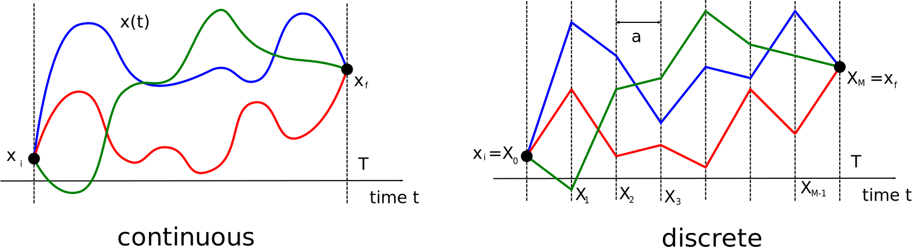
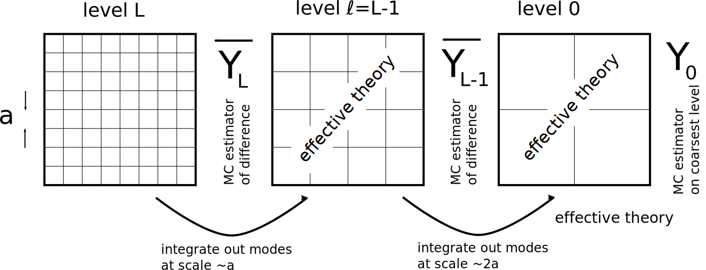

# Project overview 

Repository for the implementation of **multilevel MCMC path integral methods in quantum physics**. So far, this is for one-dimensional quantum mechnanical systems. Monte Carlo methods for those systems are described in [1], and so far the following problems have been implemented:
 * Harmonic oscillator
 * Doublewell potential
 * Quantum mechanical rotor (see [2])

The multilevel MCMC methods are described in [3]. Further details can be found in the scientific documentation in the directory `quantum/doc`.


*Fig. 1: Path integrals on a lattice*


*Fig. 2: Grid hierarchy in multilevel methods*

### Directory layout ###
The main directory is `quantum`, with the code contained in the subdirectory `quantum/src/c`. Scientific Documentation can be found in the subdirectory `quantum/doc`.
The other directory `rare_events` contain some preliminary thoughts on using multilevel MCMC methods for the path-integral evaluation of rare events.


### Compilation ###

#### Prerequisites ####
The code requires the following two packages:
 * The [Eigen library](http://eigen.tuxfamily.org/index.php?title=Main_Page) for dense linear algebra
 * The [GNU Scientific Library (GSL)](https://www.gnu.org/software/gsl/)

#### Building the code ####
Go to the code directory `quantum/src/c`. Copy the machine-specific Makefile `local_MACHINE.mk` to `local.mk` and edit if necessary, in particular set the paths to the Eigen library and the GSL. Edit compile time options in `config.h`. `make all` will build the code, `make doc` will build the doxygen documentation in the subdirectory doc. 

### Running ##
To run, type
```
./driver.x PARAMETERFILE
```

All parameters are read from the file `PARAMETERFILE` given as a command line option, so edit this accordingly. You might want to copy the file `parameters_template.in` to `parameters.in` to make a start.

### References ###
[1]: [Creutz, M. and Freedman, B., 1981. A statistical approach to quantum mechanics. Annals of Physics, 132(2), pp.427-462.](https://www.sciencedirect.com/science/article/pii/0003491681900749)

[2]: [Ammon, A., Genz, A., Hartung, T., Jansen, K., Leövey, H. and Volmer, J., 2016. On the efficient numerical solution of lattice systems with low-order couplings. Computer Physics Communications, 198, pp.71-81.](https://arxiv.org/abs/1503.05088)

[3]: [Dodwell, T.J., Ketelsen, C., Scheichl, R. and Teckentrup, A.L., 2015. A hierarchical multilevel Markov chain Monte Carlo algorithm with applications to uncertainty quantification in subsurface flow. SIAM/ASA Journal on Uncertainty Quantification, 3(1), pp.1075-1108.](https://epubs.siam.org/doi/abs/10.1137/130915005)

